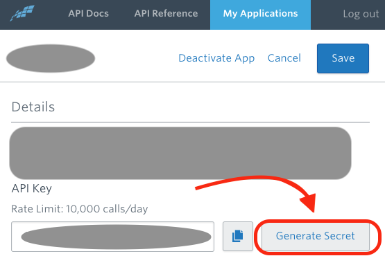

# Constant Contact
##### [alpha] Python Interface to Constant Contact API (v3)

_currently this package only creates a connection to constant contact and only one api call has been implemented as a test._

## Installation

```
git clone https://github.com/stephen-d-wells/constant_contact
cd constant_contact
pip install -r requirements.txt
pip install .
```

### If you are developing (adding to) this package _thanks!_

Fork it on github

then...

```
git clone https://github.com/<your account>/constant_contact
cd constant_contact
pip install -r requirements.txt
pip install -e .
```

## Directory Structure (layout)

Everyone has their own way of managing packages, this is what I use.

`conf` - a sym link to a configuration directory, usually housed in my home (~) directory. This directory contains senstive files that will not show up in my git repo if I sym link it. The `constant_contact` object will look for this directory to find the `constant_contact.ini` file.

example: `mkdir ~/conf; ln -s ~/conf`

If you're not concerned about having your configuration file show up in your git repo, just move the sample_conf directory to conf.

example: `mv sample_conf conf`

## Configuration

Use the following configuration file to connect to Constant Contact

#### Sample constant_contact.ini file

```
[my_ctct_app]
api_key = XXXXXXXX-XXXX-XXXX-XXXX-XXXXXXXXXXXX
app_secret = XXXXXXXXXXXXXXXXXXXXXX
redirect_uri = https://localhost
scope = contact_data
response_type = code
auth_code = XXXXX-XXXXXXXXXXXXXXX-XXXXXXXXXXXXXXXXXX
access_token = XXXXXXXXXXXXXXXXXXXXXXXXXXXX
refresh_token = XXXXXXXXXXXXXXXXXXXXXXXXXXXXXXXXXXXXXXXXXX
```

### First Timers

1. Create an account (or login) at

  [https://developer.constantcontact.com/](https://developer.constantcontact.com/)

2. Create a new Application at

  [https://app.constantcontact.com/pages/dma/portal/](https://app.constantcontact.com/pages/dma/portal/)

  **important** you'll want to set your redirect URI to `https://localhost` when you setup your application.

3. Copy your *API Key* into `conf/constant_contact.ini`

4. Generate a Secret from your API Key.

   Find the *Generate Secret* button and copy the results into your `conf/constant_contact.ini` file.

   

*You're a pro now - continue to the next section

### Initializing (Priming the Pump)

run `bin/init.py` to generate an **access_token** and **refresh_token**

   Follow the steps and copy your results into the config file

#### Required Steps

1. You will need to gather a *code* from Constant Contact. After you give permission you will be redirected to an invalid URL with the code attached at the end of it. You'll want to put this code in your configuration file.


2. Using this code you will be able to generate both your current token and refresh token. The code expires in 60 seconds so you'll want to be ready for it when it arrives.

Congratulations, you are configured to connect to constant contact's API.

#### note: if you don't connect to the API for awhile your refresh_token can become stale. If this happens you will want to re-initialize your connection again.

## Test Your Setup

You can extract a list of contacts using `bin/fetch_contacts.py`. If everything worked you'll see a list of the contacts associated with your account.

The code is as simple as:
```
from constant_contact.api.v3 import ConstantContact

import datetime

APP_ID = 'my_ctct_app'

cc = ConstantContact(APP_ID)
contacts = cc.get_contacts()

import pprint
pprint.pprint(contacts)
```

## Bugs

### Windows

I don't use windows and I suspect that my file locking mechanism would have to be moved from using _fnctl_ to something else that supports windows along with file locations. Needless to say, this hasn't been tested to work on Windows.

### Others?

Pass them along over github or better yet, send a patch.

## Contributing

Contributions are encouraged as I wrote this for a friend and I don't personally use Constant Contact.

## Author

Steve Wells ( [stephen-d-wells@github](https://github.com/stephen-d-wells) )

Linkedin: [sdwells](https://linkedin.com/sdwells)